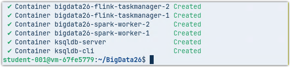
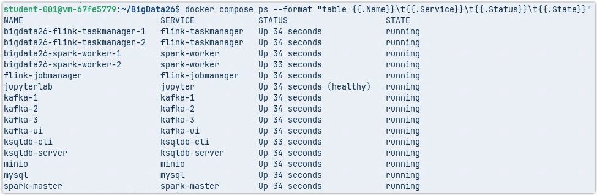
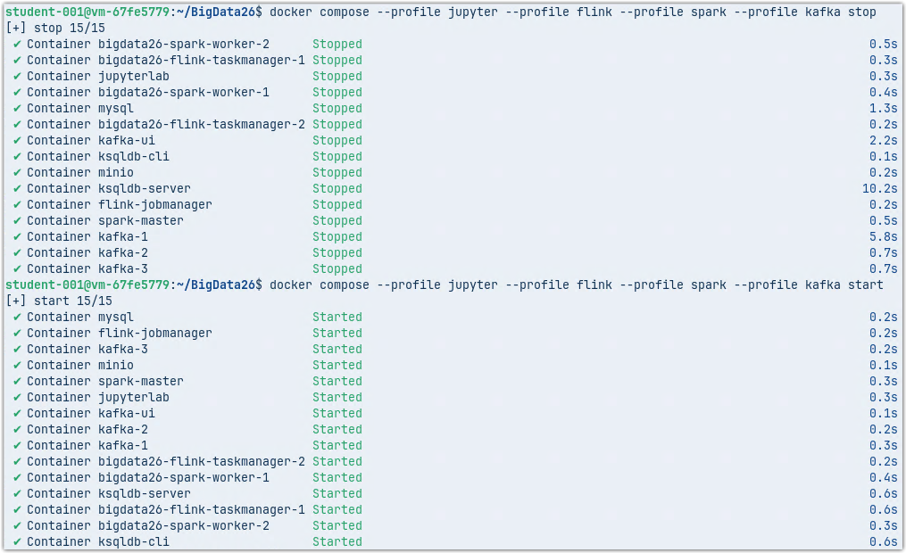
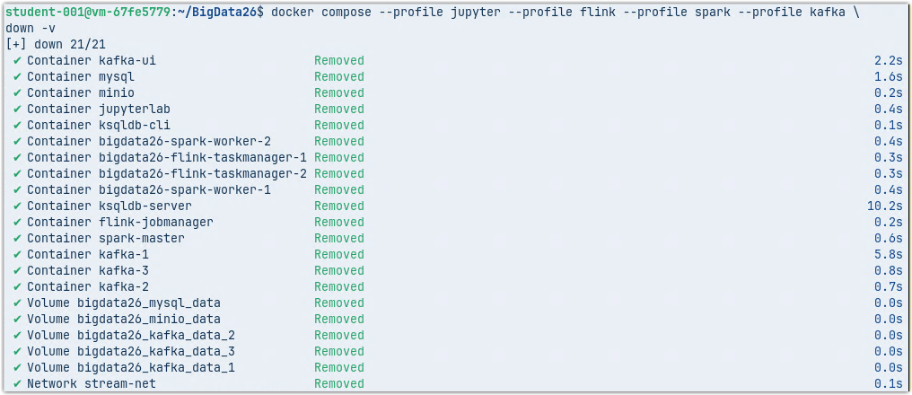

# BigData26

> *Apache Kafka, Apache Spark, Apache Flink, ksqlDB, Jupyter on Docker*

## Caution
Do not use in a production environment

## Software

* [Apache Kafka 4.1.1](https://kafka.apache.org/)
* [Kafka UI](https://github.com/provectus/kafka-ui)
* [ksqlDB Server and CLI](https://github.com/confluentinc/ksql)
* [MinIO](https://github.com/minio/)
* [MySQL 9.5](https://www.mysql.com/)
* [Jupyter](https://jupyter.org/)
* [Apache Flink 2.2.0](https://flink.apache.org/)
* [Apache Spark 4.0.1 or 4.1.1](https://spark.apache.org/)

## Intro

The *BigData26* environment is designed to replicate a comprehensive ecosystem featuring key components for both stream and batch data processing.

The stack includes: *Apache Kafka*, *Kafka UI*, *ksqlDB*, *MinIO*, *Flink*, *Spark*, and *JupyterLab*. Through this platform, participants can gain hands-on experience with the principles of distributed data processing using selected tools within a single, cohesive environment.

### Key Features

* **Docker-Based Architecture**: Built on Docker containers, the environment allows for rapid deployment and management of multiple services, mimicking real-world production infrastructure.

* **Comprehensive Dev-Stack**: Integrated with professional development tools i.e.: *IntelliJ IDEA*, *PyCharm*, and *DBeaver* enable working with *Kafka*, *Kafka Streams*, *Apache Spark*, and *Apache Flink* using *Java*, *Python*, and *Scala*, as well as data exploration in *MySQL* in a **seamless and user-friendly** manner.

* **Full Data Lifecycle**: The platform supports the entire workflow—from data ingestion and processing to analysis and results visualization.

### Architecture & Scalability

Following the microservices philosophy, each container represents a single service. Consequently, the total number of containers is relatively high due to the extensive toolset provided. Crucially, the environment is modular: in most cases, you can limit the number of running tools to only those currently required for your task.

---
---

## Quick Start

This guide shows how to deploy the *BigData26* environment using Docker Compose.

### 1. Clone the repository

To deploy the cluster, run:
```sh
git clone https://github.com/BigDataKJCourses/BigData26.git
cd BigData26
```

### 2. Setting Apache Spark version

Edit `.env` file and set right Apache Spark version (`4.0.1` or `4.1.1`)

Note: `4.0.1` can use Delta Lake library

### 3. Create additional folders

Create additional folders used by Docker volumes within the `BigData26` directory.

```sh
mkdir notebooks
mkdir lib-shared
mkdir shered_workspace
```

### 4. Start *BigData26*

Start your cluster
```sh
docker compose --profile jupyter --profile flink --profile spark --profile kafka \
up -d --scale flink-taskmanager=2 --scale spark-worker=2 
```

<center>
    
</center>

The image build process may take a few moments depending on your resources. Please wait...

Verify the status of the running containers.
```sh
docker compose ps --format "table {{.Name}}\t{{.Service}}\t{{.Status}}\t{{.State}}"
```

<center>
    
</center>

### 5. Post-launch configuration

#### Edit `hosts`

Edit your `hosts` file and add all nodes of your cluster
```sh
# BigData26
127.0.0.1	kafka-1
127.0.0.1   kafka-2
127.0.0.1   kafka-3
127.0.0.1	kafka-ui
127.0.0.1   minio
127.0.0.1   mysql
127.0.0.1   spark-connect
127.0.0.1   spark-master
127.0.0.1   spark-history-server
127.0.0.1   ksqldb-cli
127.0.0.1   flink-jobmanager
127.0.0.1   jupyterlab
```

#### Installing Additional Software 

The *BigData26* environment is pre-configured for Docker, but for full development capabilities, you should install additional software locally:

* *IntelliJ IDEA* (for Java/Scala development)
* *PyCharm* (for Python/Spark scripts)
* *DBeaver* (for MySQL and ksqlDB data exploration)

Install `mc` - *MinIO client*

```sh
wget https://dl.min.io/client/mc/release/linux-amd64/mc
chmod +x mc
sudo mv mc /usr/local/bin/mc
mc alias set local https://localhost:9000 admin password
```

---
---

## Access interfaces with the following URL

Use `BigData26 Interfaces.html` to access the web interfaces of the tools provided.

## Additional Info 

For more details, please refer to the following guides:
* [Detailed Environment Description](ENVIRONMENT.md) – Learn more about the components and architecture.
* [How To Guide & Examples](USAGE.md) – Step-by-step instructions on how to use the tools.

## Shutting Down the Environment

You can close the environment in several ways, but two are the most important depending on whether you want to save your progress:

**A. Pausing Work (Keep Data)**

The `stop` command shuts down all containers but preserves their internal state and data. You can later resume exactly where you left off using `docker compose start`.

```bash
docker compose --profile jupyter --profile flink --profile spark --profile kafka stop
```

<center>
    
</center>

**B. Full Reset (Delete Everything)**

The `down -v` command removes the containers along with all their volumes (databases, Kafka topics, MinIO files). When you run the environment again, it will be completely fresh.

*Note: Only the `shared_workspace` directory on your physical disk and corresponding docker volumes remains unchanged.*

```bash
docker compose --profile jupyter --profile flink --profile spark --profile kafka down -v
```

<center>
    
</center>