# Component Overview
You do not need to test every component at this stage. Focus only on those that are relevant to your current course.

## Kafka & ksqlDB

### Apache Kafka – Message Broker

1. **Log in to the first Kafka node:**

```bash
docker compose exec -it kafka-1 bash
```

2. **Create a Topic:**
In Kafka, data is transmitted through "topics." Let's create a topic named `test-topic`, replicated across all 3 nodes for high availability

```bash
/opt/kafka/bin/kafka-topics.sh --create --topic test-topic \
--bootstrap-server kafka-1:9092 --replication-factor 3 --partitions 1
```

<div align="center">
    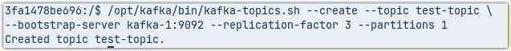
</div>

3. **Start a Producer:**
Now, we will turn this terminal into a "producer". Everything you type here will be sent to Kafka

```bash
/opt/kafka/bin/kafka-console-producer.sh --topic test-topic \
--bootstrap-server kafka-1:9092
```

4. **Send Messages:**
Once started, a prompt `>` will appear. Type a few sentences, for example

```
Witaj w BigData26!
To jest moja druga wiadomość.
```

<center>
    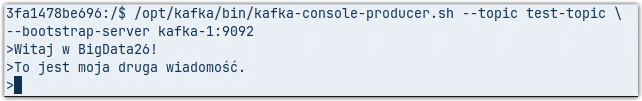
</center>

**(Do not close this "producer" terminal!)**

5. **Start a Consumer:**
Open a **new terminal** window, navigate to your project folder, and start the "consumer". <br>
The `--from-beginning` flag ensures that the consumer reads everything from the very start of the topic's history. You should see the messages you typed earlier.

```bash
cd ~/BigData26/
docker compose exec -it kafka-1 /opt/kafka/bin/kafka-console-consumer.sh \
--topic test-topic --from-beginning --bootstrap-server kafka-1:9092
```

<center>
    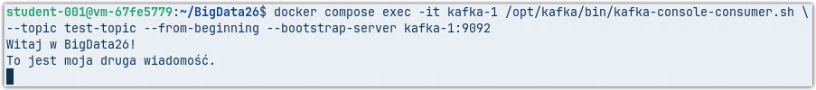
</center>

## Kafka UI – Visualization
Instead of using terminal commands, you can view the same data through your web browser.

6. **Open the Kafka Dashboard:** 
   Open our environment's web interface control panel (`BigData26 Interfaces.html`) and click on **Kafka Dashboard**, or go directly to: [http://localhost:8085](http://localhost:8085)

<center>
    
    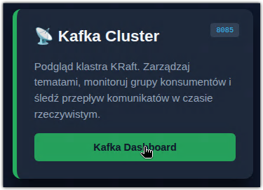
</center>

7. **Browse Topics and Messages:**
   Go to the **Topics** tab in the left-hand menu and find `test-topic` in the list. Click on it, then select the **Messages** tab. You will see your messages there, along with information about the partition and the exact time they were recorded.

<center>
    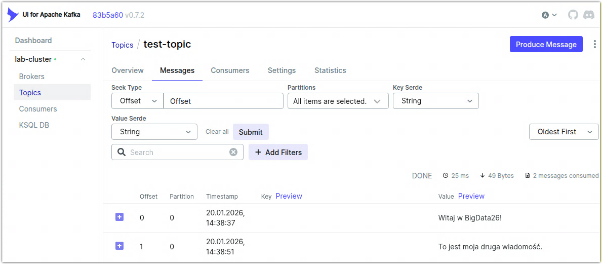
</center>

## ksqlDB – SQL for Data Streams

8. **Connect to the ksqlDB engine:**
   Open a new terminal and use the ksqlDB CLI client to connect to the server:

```bash
docker exec -it ksqldb-cli ksql http://ksqldb-server:8088
```

9. **Create a Stream:**
Tell ksqlDB to treat the data from the Kafka topic as a stream with a text column:

```sql
CREATE STREAM message_monitor (content VARCHAR) 
WITH (KAFKA_TOPIC='test-topic', VALUE_FORMAT='DELIMITED');
```

10. **Start listening**:
Run a continuous query to monitor incoming data:

```sql
SELECT * FROM message_monitor EMIT CHANGES;
```

11. **Test the Flow:**
Go back to the "producer" terminal where the Producer is running and type a new message, for example:
```
Do trzech razy sztuka
```

<center>
    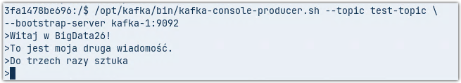
</center>

12. **Verify results:**
In the ksqlDB client terminal, the new message should appear instantly.

<center>
    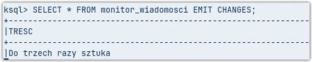
</center>

13. **Cleanup:**
Stop the ksqlDB client, Producer, and Consumer sessions by pressing `Ctrl+C`. You can exit the ksqlDB client by typing `exit`. The same command will allow you to exit the kafka-1 container session.

## Storage and Database Layer

### MinIO (S3 Compatible Storage)

14. **Access the Storage Console:**
    Open our environment's web interface control panel and click on **MinIO Storage – S3 Browser**, or navigate directly to:
    [http://localhost:9001](http://localhost:9001)

<center>
    
    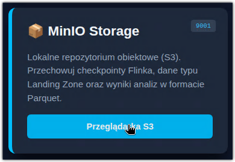
</center>

15. **Log in to MinIO:**
    Log in to the MinIO web interface using the following credentials:

    * **Username:** `admin`
    * **Password:** `password`

<center>
    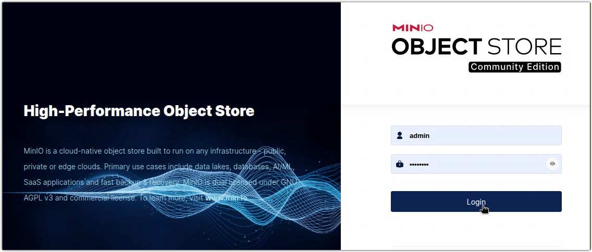
</center>

16. **Create a Bucket:**
    Create a "bucket," which functions as a directory within the distributed file system. Name it `lake-zone`. This can serve as a landing zone or destination for data processed by *Apache Spark* or *Apache Flink*.

<center>
    
</center>

17. **Upload a File:**
    Enter the newly created `lake-zone` bucket. Select **Upload** -> **Upload File**. Choose any small file from your computer (e.g., the `docker-compose.yml` file from the `BigData26` directory).
    By doing this, you have manually placed a file into the MinIO service. It is physically stored within the Docker volume named `minio_data`.

<center>
    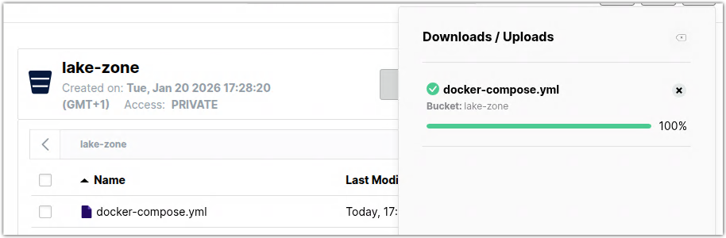
</center>

18. **Access MinIO via Command Line (mc):**
    You can also manage MinIO content using the `mc` (MinIO Client) tool. Run the following commands in a free terminal:
```bash
# List all aliases/locations
mc ls local

# List content of the lake-zone bucket
mc ls local/lake-zone

# Remove the file you just uploaded
mc rm local/lake-zone/docker-compose.yml
```

19. **Classic Data Ingestion Example:**
    Let's use a classic text file to test the flow. We will download a collection of Sherlock Holmes stories and upload them to our bucket using the terminal:

```bash
# Download the text file
wget https://sherlock-holm.es/stories/plain-text/cano.txt

# Upload the file to the lake-zone bucket
mc put cano.txt local/lake-zone

# Verify the file is now in the bucket
mc ls local/lake-zone
```

### MySQL (Relational Database)

20. **Connect to the MySQL database:**
    Use a free terminal to connect to the MySQL instance running inside the container:
    ```bash
    docker exec -it mysql mysql -u root -ppassword lab_db
    ```
    *(Note: Using `-ppassword` directly attaches the password to the flag. Ensure there is no space if you are prompted for one.)*

21. **Create a table:**
    Run the following command to create a table for storing messages. Stay in this MySQL session for further tasks:
```sql
CREATE TABLE kafka_messages (
    id INT AUTO_INCREMENT PRIMARY KEY,
    content TEXT,
    created_at TIMESTAMP DEFAULT CURRENT_TIMESTAMP
);
```

### Compute Layer (Spark & Flink)

Now we will use our two big data processing engines. **Apache Spark** will load sample data into a Parquet file directory, while **Apache Flink** will read data from a Kafka topic and write it to the MySQL relational database.

#### Apache Spark

22. **Create a Spark Script:**
    Open *Visual Studio Code* and create a new file named `spark_to_minio.py` in the `BigData26/shared_workspace` directory.

23. **Add the following code to the file:**

```python
from pyspark.sql import SparkSession

# Initialize Spark Session with MinIO configuration
spark = SparkSession.builder \
    .appName("SparkToMinIO") \
    .config("spark.hadoop.fs.s3a.endpoint", "http://minio:9000") \
    .config("spark.hadoop.fs.s3a.access.key", "admin") \
    .config("spark.hadoop.fs.s3a.secret.key", "password") \
    .config("spark.hadoop.fs.s3a.path.style.access", "true") \
    .config("spark.hadoop.fs.s3a.impl", "org.apache.hadoop.fs.s3a.S3AFileSystem") \
    .getOrCreate()

# 1. Create simple sample data
data = [("Kafka", "Streaming"), ("Spark", "Batch/Stream"), ("Flink", "Real-time")]
df = spark.createDataFrame(data, ["Technology", "Type"])

# 2. Write to MinIO in Parquet format (Big Data standard)
df.write.mode("overwrite").parquet("s3a://lake-zone/technologies.parquet")

print("Successfully saved to MinIO!")
spark.stop()
```

24. **Execute the Spark Script:**
    The `BigData26/shared_workspace` directory serves as a volume for the `/opt/workspace/` directory inside the `spark-master` container. Let's run our program using the terminal:

```bash
docker exec -it spark-master /opt/spark/bin/spark-submit \
--master spark://spark-master:7077 /opt/workspace/spark_to_minio.py
```

25. **Verify the Output:**
    Check if the resulting data has reached its destination using the terminal:

```bash
mc ls local/lake-zone/technologie.parquet
```

<center>
    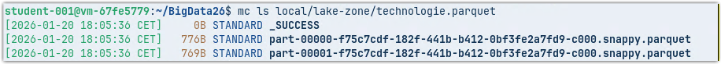
</center>

26. **Monitor via Spark Web UI:**
    Open the control panel (web interface page) and click **Apache Spark – Cluster Master**, or go to: 
    [http://localhost:8080/](http://localhost:8080/)
    Identify the application you just executed in the *Completed Applications* list.

<center>
    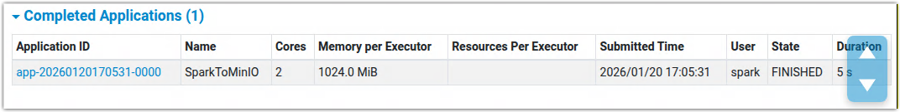
</center>

27. **Interactive PySpark REPL:**
    Let's test the interactive PySpark environment. Launch `pyspark` on the `spark-master` container:

```bash
docker exec -it spark-master /opt/spark/bin/pyspark --master spark://spark-master:7077
```

28. **Configure MinIO Connection in REPL:**
    Inside the PySpark shell, set the necessary configuration variables:

```python
# Configure MinIO connection
spark.conf.set("fs.s3a.endpoint", "http://minio:9000")
spark.conf.set("fs.s3a.access.key", "admin")
spark.conf.set("fs.s3a.secret.key", "password")
spark.conf.set("fs.s3a.path.style.access", "true")
spark.conf.set("fs.s3a.impl", "org.apache.hadoop.fs.s3a.S3AFileSystem")
```

29. **Analyze the Sherlock Holmes File:**
    Let's process the `cano.txt` file we uploaded earlier:

```python
from pyspark.sql.functions import length

# Load the text file as a DataFrame
df = spark.read.text("s3a://lake-zone/cano.txt")

# Count the number of lines
line_count = df.count()
print(f"Number of lines in the file: {line_count}")

# Preview the first 5 lines that are longer than 10 characters
df.where(length(df.value) > 10).show(5, truncate=False)
```

30. **Exit PySpark:**
    Close the interactive shell by typing:
```python
quit()
```

### Apache Flink

Now we will use *Apache Flink*. One of its most powerful APIs is *Flink SQL*, which allows us to process streams using familiar syntax.

31. **Launch Flink SQL Client:**
    Use an available terminal to start the interactive SQL shell:

```bash
docker exec -it flink-jobmanager ./bin/sql-client.sh
```

32. **Define the Kafka Source:**
    Inside the Flink SQL client, "connect" to our existing Kafka topic:
    
```sql
CREATE TABLE kafka_source (
    content STRING
) WITH (
    'connector' = 'kafka',
    'topic' = 'test-topic',
    'properties.bootstrap.servers' = 'kafka-1:9092,kafka-2:9093,kafka-3:9094',
    'properties.group.id' = 'flink-group',
    'scan.startup.mode' = 'earliest-offset',
    'format' = 'raw'
);
```

33. **Define the MySQL Sink:**
    Now, "connect" to our MySQL table created earlier:

```sql
CREATE TABLE mysql_sink (
    content STRING
) WITH (
    'connector' = 'jdbc',
    'url' = 'jdbc:mysql://mysql:3306/lab_db',
    'table-name' = 'kafka_messages',
    'username' = 'root',
    'password' = 'password'
);
```

34. **Start the Streaming Job:**
    Run the following command to start a continuous background job that moves data from Kafka to MySQL:

```sql
INSERT INTO mysql_sink SELECT content FROM kafka_source;
```

<center>
    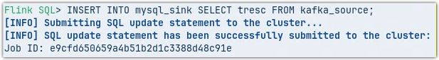
</center>

35. **Monitor via Flink Web UI:**
    Open the control panel and click **Apache Flink – Flink Manager**, or go directly to:
    [http://localhost:8081/](http://localhost:8081/)
    Select the running job to see the data flow metrics in real-time.

<center>
    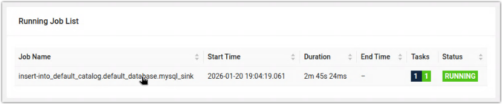<br>
    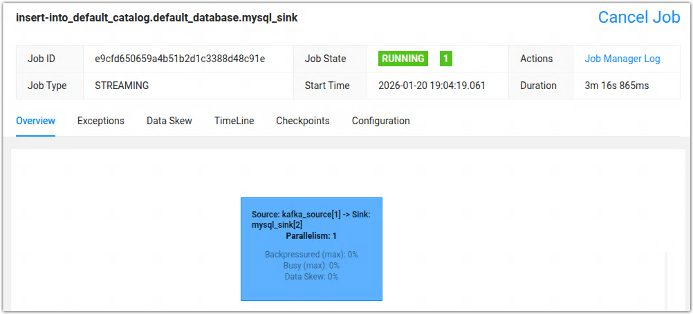
</center>

36. **Test the End-to-End Pipeline:**
    Open an available terminal and restart the Kafka Producer:

```bash
docker compose exec -it kafka-1 /opt/kafka/bin/kafka-console-producer.sh \
--topic test-topic --bootstrap-server kafka-1:9092
```

37. **Send a Trigger Message:**
    Type a new message that will be picked up by Flink and sent to MySQL:
```
Wiadomość wysłana do MySQL przez Flinka!
```

<center>
    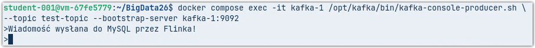
</center>

38. **Verify Data in MySQL:**
    Switch back to the terminal with your active MySQL session and check the table contents:

```sql
SELECT * FROM kafka_messages;
```

<center>
    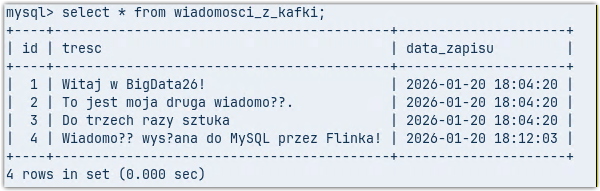
</center>

*You should see your message there with an automatically generated timestamp.*

39. **Cleanup and Stopping Jobs:**
    * Exit the Kafka Producer by pressing **Ctrl+C**.
    * Exit the MySQL session by typing `exit;`.
    * Exit the Flink SQL Client by typing `exit;`.

    **Note:** Exiting the SQL Client does not stop the background job. To stop the data flow, go to the **Flink Web UI** (http://localhost:8081/), select the running job, and click **Cancel Job**.

<center>
    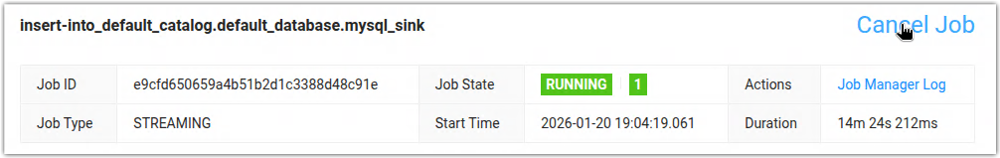
</center>

## Analytical Layer (User Interface)

### JupyterLab

The final component of our stack is *JupyterLab*, which serves as our interactive workspace for data science and analysis.

40. **Access JupyterLab:**
    Open the control panel and click **JupyterLab – Launch Workspace**, or navigate directly to:
    [http://localhost:8888/](http://localhost:8888/)
    * **Password:** `password`

41. **Set Up Your Notebook:**
    Create a new Python notebook and add the following cells to prepare your environment:

* **Install Required Libraries:**
Run this cell to install the necessary visualization and data manipulation tools:

```python
%pip install matplotlib pandas
```

* **Verify Installation:** You can check if the libraries are ready by importing them:

```python
import pandas as pd
import matplotlib.pyplot as plt

print("Pandas and Matplotlib are ready to use!")
```

* **Create Spark Context with MySQL Driver:**
In a new cell, initialize the Spark session. We will include the MySQL connector to allow Spark to communicate with our database:

```python
from pyspark.sql import SparkSession
from pyspark.sql.functions import split, explode, lower, col
import matplotlib.pyplot as plt

# Initialize session with MySQL connector
spark = SparkSession.builder \
    .appName("MySQL_Analysis_With_Charts") \
    .master("spark://spark-master:7077") \
    .config("spark.jars.packages", "com.mysql:mysql-connector-j:9.5.0") \
    .getOrCreate()
```

* **Fetch Data from MySQL:**
Connect to the database and load the messages sent earlier by Flink:

```python
# 1. Fetching data from MySQL via JDBC
df_mysql = spark.read \
    .format("jdbc") \
    .option("url", "jdbc:mysql://mysql:3306/lab_db") \
    .option("dbtable", "kafka_messages") \
    .option("user", "root") \
    .option("password", "password") \
    .load()
```

* **Perform Word Count Analysis:**
Process the raw text to find the most frequent words:

```python
# 2. Processing: split sentences into words and count occurrences
# We use the 'content' column from our database schema
word_counts_df = df_mysql.select(explode(split(lower(col("content")), "\s+")).alias("word")) \
    .groupBy("word") \
    .count() \
    .orderBy(col("count").desc()) \
    .limit(10) # Take the top 10 most frequent words
```

* **Visualize Results with Matplotlib:**
Convert the results to a Pandas DataFrame and generate a bar chart:

```python
# Convert to Pandas for easy plotting
pandas_df = word_counts_df.toPandas()

# 3. Generating the chart
plt.figure(figsize=(10, 6))
plt.bar(pandas_df['word'], pandas_df['count'], color='skyblue')
plt.xlabel('Word')
plt.ylabel('Occurrences')
plt.title('Top 10 Words: From Kafka through Flink to MySQL')
plt.xticks(rotation=45)
plt.show()

# Stop the session
spark.stop()
```